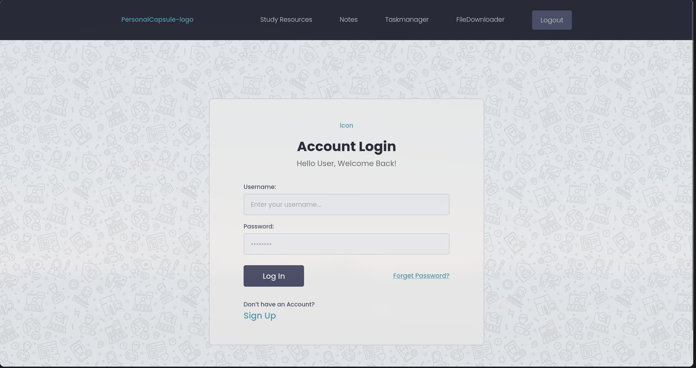
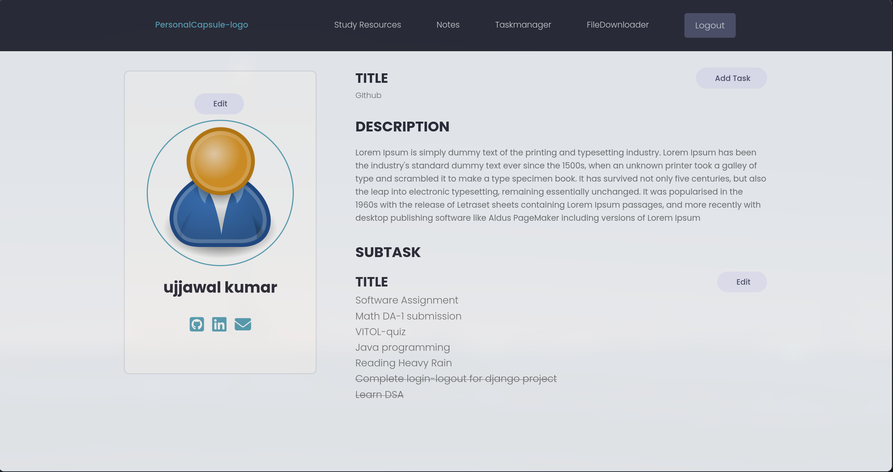
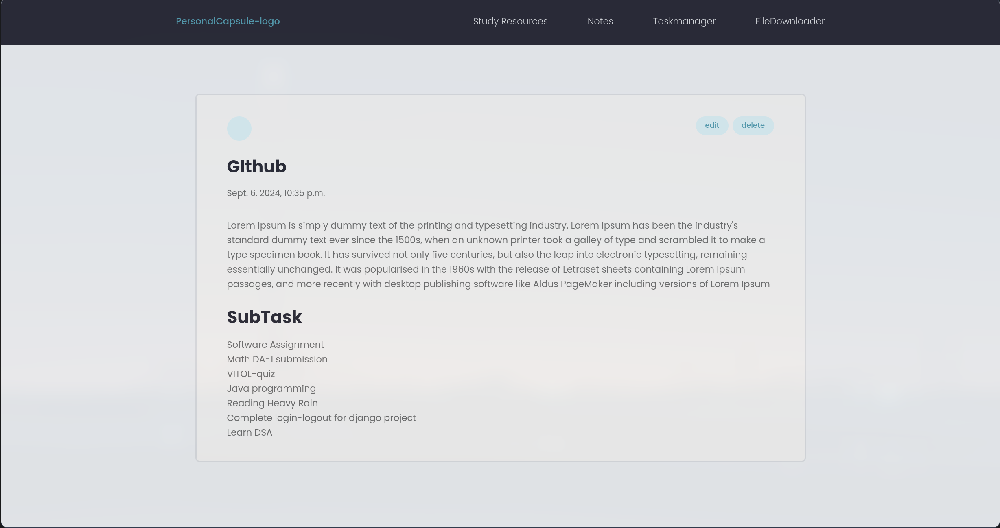
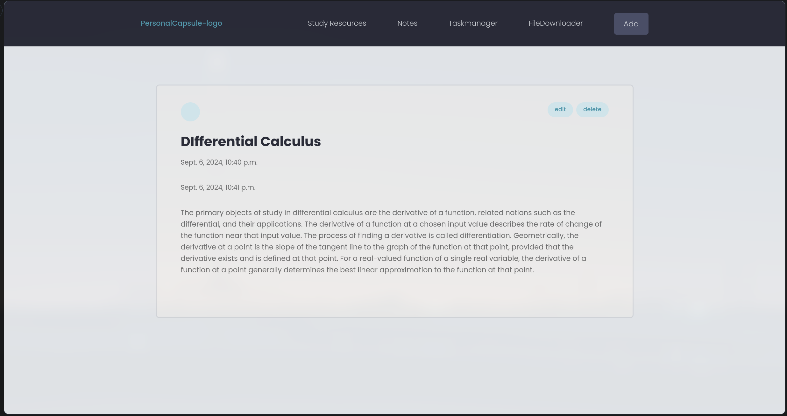
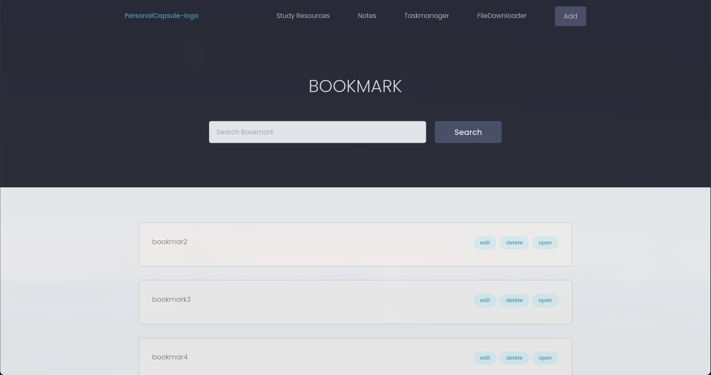

# personal_capsule
  Django based webstie for the academic helps. key idea is to bring together several key features that students need on a daily basis.
# Key features:
- Task Management: Add, track, and modify daily tasks
- Note-Taking: Create and store study notes
- esource Library: Save hyperlinks and video links
- User-Friendly Interface: Easy to navigate and use

# LOGIN

# Profile

# Daily Task
 ### with CRUD Functionality

# Notes
 ### with CRUD Functionality

# Bookmarks
 ### with CRUD Functionality

